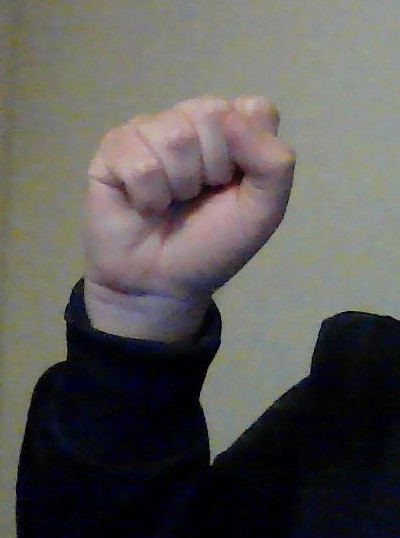
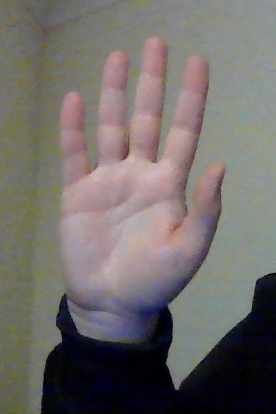
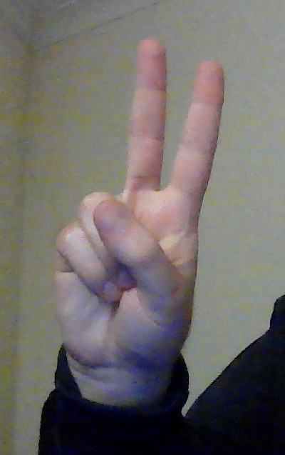

# What is this project?
This project is a simple rock paper scissors game that can be played by using hand gestures via camera.

# Milestone 1
I have created a simple model containing 4 classes; rock, paper, scissors and nothing. This model will be used to detect user gestures and play the game.
## Classes
### 1. Rock

One hand lifted up and clenched into a fist

### 2. Paper

One hand lifted up with palm fully visible

### 3. Scissors

One hand lifted up with index and middle finger fully extended while rest is fully closed

### 4. Nothing
Both hands down

# Milestone 2
I have configured my python environment using miniconda3, I have then used a code snippet to see if I can run it and installed all prerequisites as required. Please see requirements.txt for full list of dependencies.

# Milestone 3
I have create the minimal logic required to make the game playable, currently the game can only be played by manually typing in the a choice into the terminal. The game can be run by either running the main.py or app/manual_rps.py files.

The entire game runs on only 4 functions, these are:

| Function | Definition |
| - | - |
get_computer_choice | This function simply picks between "Rock", "Paper or "Scissors" based on random.choice() function.
get_user_choice | This function asks the user to input their choice, it can also shutdown the game if it gets the "Nothing" input.
get_winner | This function determines a winner by comparing inputs and informs the user of the outcome.
play | This function runs the game.